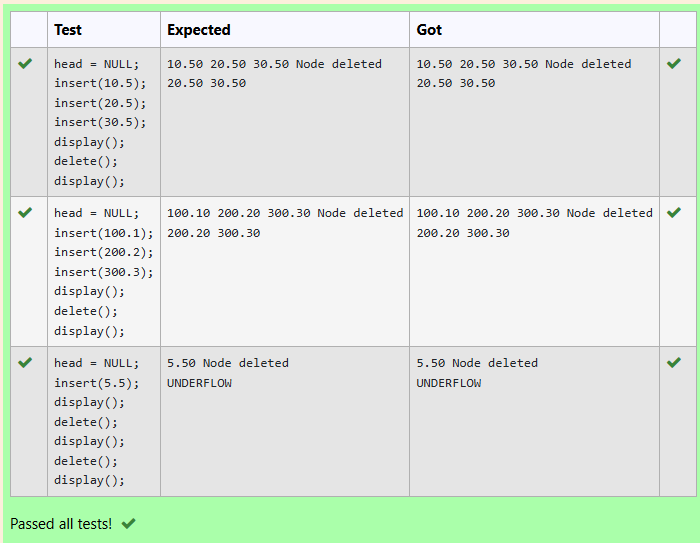

# 🔢 Digit Frequency Counter in a String
## 📌 AIM
To write a C program that counts and prints the frequency of each digit (0–9) present in a given alphanumeric string.

## 📖 Description
The program reads a string containing both alphabets and digits. It calculates how many times each digit (from 0 to 9) appears in the string and prints the results as ten space-separated integers.

## 📋 Input Format
A single alphanumeric string (up to 20 characters in this code version).

## 📤 Output Format
Ten space-separated integers, each representing the count of digits from 0 to 9, in order.

## 🧠 Algorithm
Declare an integer array freq[10] initialized to 0 to keep count of digits 0–9.

Read the input string using scanf.

Traverse each character of the string:

If the character is a digit ('0' to '9'), increment the corresponding index in the freq array.

Print the contents of freq with spaces between them.

## 💻 Program
```
#include <stdio.h>
#include <string.h>

int main() {
    char str[20];  // Assuming a maximum length of 1000 for input string
    int freq[10] = {0}; // Array to store frequency of digits (0-9)

    // Taking input string
    scanf("%s", str);

    // Iterate through the string
    for (int i = 0; i < strlen(str); i++) {
        if (str[i] >= '0' && str[i] <= '9') { // Check if character is a digit
            freq[str[i] - '0']++; // Increment frequency
        }
    }

    // Print the frequency of each digit from 0 to 9
    for (int i = 0; i < 10; i++) {
        printf("%d ", freq[i]);
    }

    return 0;
}

```
## 🧪 Sample Input & Output

## ✅ Output Explanation
Digits in the string: 1, 4, 5, 4, 1, 7, 7

Frequencies:

0 → 0 times

1 → 2 times

2 → 0 times

3 → 0 times

4 → 2 times

5 → 1 time

6 → 0 times

7 → 2 times

8 → 0 times

9 → 0 times

## 📌 Notes
This program assumes the input string will not exceed 20 characters. Adjust the array size (char str[1000]) if longer strings are expected.

It only counts digit characters and ignores letters or symbols.

## 📝 Result
The program efficiently calculates the digit frequency from a string and outputs the counts in a standardized format.

