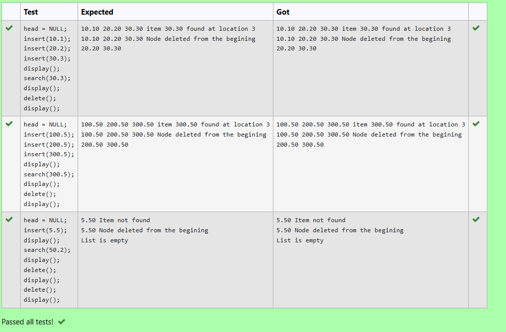

# 📘 Display Stack Elements Using Array (C Programming)
## 📌 Overview
This program demonstrates how to implement a stack using an array in C and display its elements from top to bottom. It includes basic stack operations like push() and display() using a top pointer.


## 📂 Code Snippet
```
int stack[100],top,i;
void display()
{
    for (i=top;i>-1;i--){
        printf("%d->",stack[i]);
    }
}
```

## 🧪 Sample Output

## 🧠 Learning Objectives
Understand how to implement a stack using an array.

Learn how to use the top variable to manage stack operations.

Implement display() to show stack elements in LIFO order.

## 🛠️ How to Run
### Copy the code into a .c file (e.g., stack_display.c)

### Compile using a C compiler:

```
gcc stack_display.c -o stack_display
```
### Run the executable:

```
./stack_display
```
## ⚠️ Notes
The stack[] has a fixed maximum size of 100.

This example focuses on basic stack operations (push, display) without pop.

Ensure top is initialized to -1 at the start.

