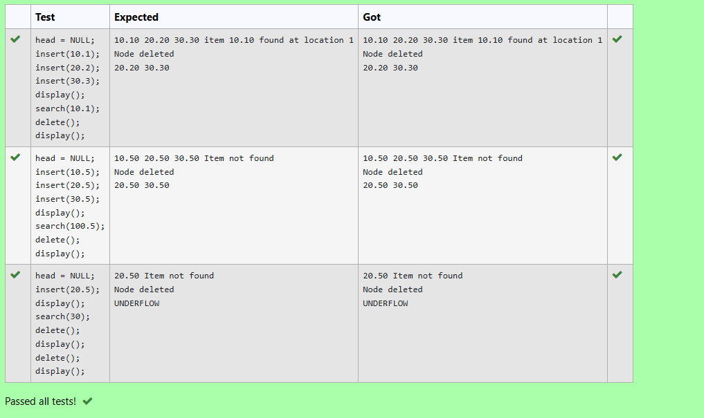

# 🔀 Lexicographical Permutations of String Array
## 📌 AIM
To write a C program that takes an array of strings (sorted in lexicographical order) and prints all unique permutations in strict lexicographical order.

## 📖 Description
Given a list of strings (which may include duplicates), this program prints all unique permutations of the strings in lexicographically sorted order.

It avoids printing duplicate permutations, even when the input contains duplicate strings.

## 📋 Input Format
First line: An integer n, the number of strings.

Next n lines: Each line contains a string made up of lowercase English letters.

## 📤 Output Format
Each permutation is printed on a single line, with the strings separated by a space.

Each permutation is printed in lexicographical order.

Duplicate permutations are not printed.

💡 Constraints
1 <= n <= 8

Strings contain only lowercase English letters.

## 💻 Program
```
#include <stdio.h>
#include <string.h>

void swap(char arr[][100], int i, int j) {
    char temp[100];
    strcpy(temp, arr[i]);
    strcpy(arr[i], arr[j]);
    strcpy(arr[j], temp);
}

void sort_strings(char arr[][100], int n) {
    for (int i = 0; i < n - 1; i++) {
        for (int j = i + 1; j < n; j++) {
            if (strcmp(arr[i], arr[j]) > 0) {
                swap(arr, i, j);
            }
        }
    }
}

int next_permutation(char arr[][100], int n) {
    int i = n - 2;

    while (i >= 0 && strcmp(arr[i], arr[i + 1]) >= 0)
        i--;

    if (i < 0)
        return 0;  // No more permutations

    int j = n - 1;
    while (strcmp(arr[i], arr[j]) >= 0)
        j--;

    swap(arr, i, j);

    int left = i + 1, right = n - 1;
    while (left < right) {
        swap(arr, left, right);
        left++;
        right--;
    }

    return 1;
}

int main() {
    int n;
    scanf("%d", &n);
    
    char arr[n][100];  // Array of strings
    for (int i = 0; i < n; i++) {
        scanf("%s", arr[i]);  // Read each string
    }

    sort_strings(arr, n);

    for (int i = 0; i < n; i++)
        printf("%s ", arr[i]);
    printf("\n");

    while (next_permutation(arr, n)) {
        for (int i = 0; i < n; i++)
            printf("%s ", arr[i]);
        printf("\n");
    }

    return 0;
}

```

  
## 🧪 Sample Input & Output

## 🧠 Algorithm Explanation
Sorting the strings: Ensures that permutations are generated in lexicographical order.

Generating next permutation: A modified version of the C++ STL next_permutation function is used.

Swapping and reversing: To get the next permutation correctly.

Avoiding duplicates: Since the algorithm generates permutations in sorted order, duplicates are naturally skipped.

## 📝 Notes
The array size for strings is fixed at 100, which can be increased as needed.

This approach is efficient and avoids recursion.

It automatically skips repeated permutations when duplicates are present.

## ✅ Result
The program correctly prints all unique permutations of the input string list in lexicographical order.